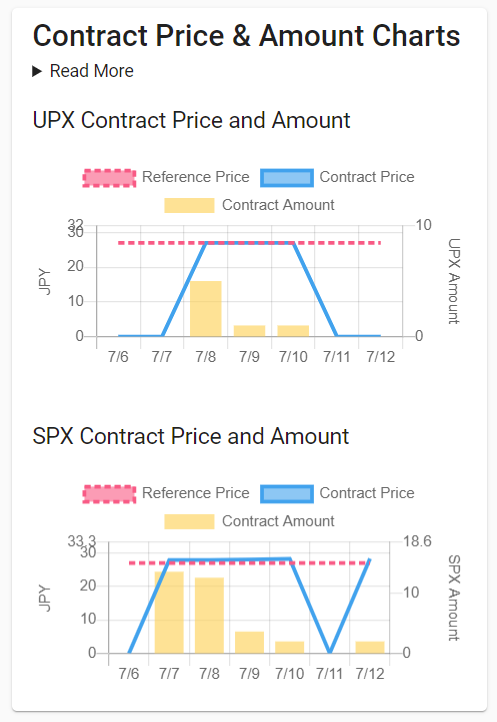
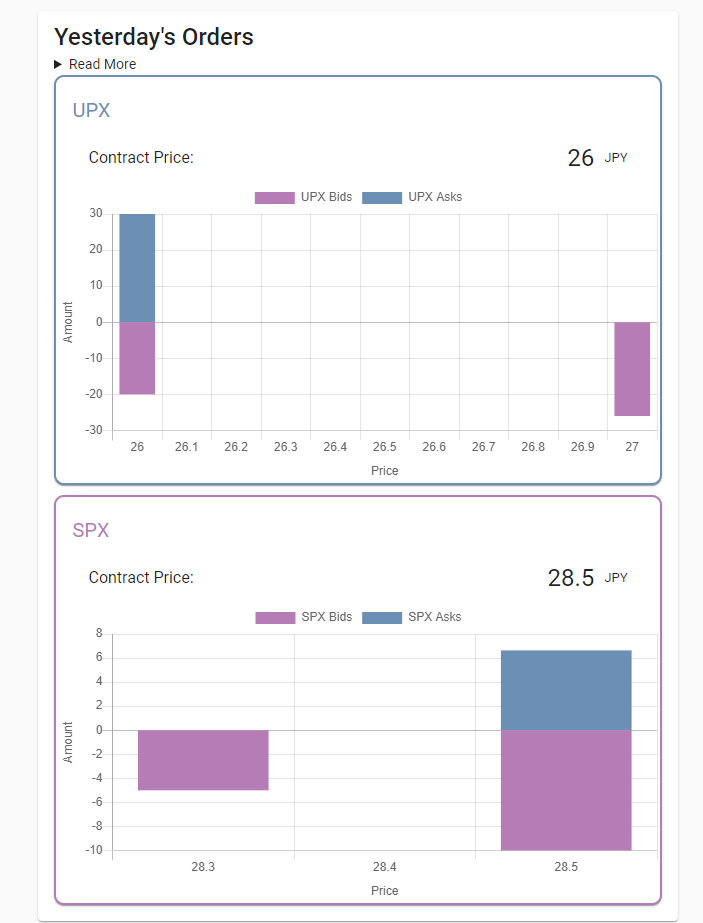
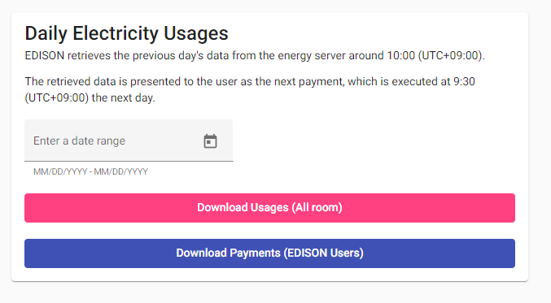
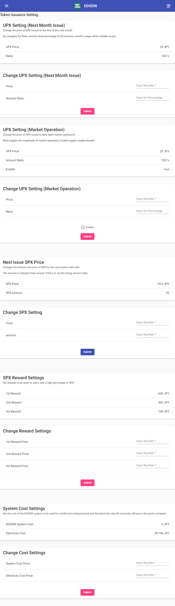

# EDISON アップデート 2022/07-2023/02

2023/03/07 [株式会社 CauchyE](https://cauchye.com/) 大村瀬奈 作成

## 概要

2022年7月1日より京都大学大学院総合生存学館の合宿型研修施設にてシステム実証実験を開始して、2022年2月末まで実施します。

この期間中に追加で行われたEDISONのアップデートが以下になります。

## Ver2.0.1

### 2022/07/12

1. 注文を行っていない学生へのメール配信について

   - 毎日21時に以下の文面で行う

    ```dotnetcli

    From: <kyoto.sic.bc.edison@gmail.com>
    Subject: 【EDISON】本日の注文がまだされておりません
    To: <tdj65.senatan+1@gmail.com>

    test01様

    test01様は、EDISONでの本日の注文をまだ行っておりません。
    明日の午前9時までの注文をお願いいたします。

    以下のページ Orderにて注文状況をご確認いただけます。
           <https://edison-dev-1c1b5.web.app/txs>

    京都大学EDISONチーム
    ```

2. 過去の成約価格履歴の表示改善

   - 以下のように，取引のなかった日については価格，量ともに0のデータを表示する仕様に変更しました。また，最新の取引価格はこれまで同様に取引があった最新の日付のデータを表示しています。
   - この変更に合わせてバックエンドにオークションがゼロ成約の場合の処理を変更しています。
  
    

3. 前日分の注文状況のグラフ表示

     - 買い注文を負の値で，売り注文を正の値とすることで上下に分かれたグラフとしております。

    

## Ver2.0.2

### 2022/07/20

1. CSVダウンロード機能の拡充

   - 管理者Dashboardに以下の機能を追加

     - DailyUsage（すべての部屋）のダウンロード
     - DailyPayment（DailyUsageをどのトークンで支払ったか）のダウンロード

    

   - CSV内の1000000倍表示を廃止、その他パフォーマンスの改善

### 2022/07/31

1. 月末の精算のバックエンド変更
   - 月末の精算を任意のタイミングで任意の金額で実行できるように修正。京大での請求金額の確定が翌月になることから仕様の変更を行っております。

## Ver2.0.3

### 2022/07/28

1. 月初のトークン付与を可変にするためのバックエンドおよびフロントエンド
   - バックエンド
      - PrimaryAskで発行されるUPXの価格を可変にするためのデータベース変更
      - Adminからのトークン注文価格が0.1JPYずつ上がる機能を廃止
   - フロントエンド (画像は末尾に添付)
      - UPXの価格等を変更する管理者用フロントエンドへの機能追加
      - PrimaryAskの価格変更機能
      - PrimaryAskが前月の何割を対象としたトークン発行を行うかを変更する機能
      - UPXとSPXの基準価格が変更された旨を赤字で注文ページ及びDashboardに表示
      - 過去の成約履歴の基準価格線を変更

### 2022/08/29

1. 月末精算の内部計算を東一条館および船哲房・廣志房の料金体系に基づいて変更
   - 前月実績に基づいた電気料金計算の内部処理を実装

2. 9月以降のトークン価格変更
   - UPX 21.5JPY, SPX 22JPYに変更

## Ver2.0.4

### 2022/09/30

1. Admin Dashboardの仕様変更
   - Past OrdersとDaily Electricity Usagesのダウンロードにおける日付指定の範囲の仕様変更
  
        これにより 9/14-9/14のように指定された場合にも該当する日のデータがダウンロードされます。
      - ex. 9/14~9/16とした場合のダウンロード対象のデータ

        変更前 9/14 0:00から9/16 0:00まで
        変更後 9/14 0:00から9/16 23:59まで

### 2022/01/13

1. 2月以降のトークン価格変更
   - UPX 25JPY, SPX 25.5JPYに変更

## バグ修正およびパフォーマンス改善

EDISON保守として期間内に発生した以下の問題に対処とパフォーマンスの改善を行っています。（アップデートの請求には含まれません。）

- v2.0.2

  - Dashboardの読み込み高速化（2022/07/25）
  - システムの買い注文が正常に作成されない問題の修正（2022/07/26）
  - 電気使用量が0だった場合に履歴に表示されない問題の修正（2022/07/29）
    - ユーザーフィードバックを受け修正しました。特定の条件下で表示のみの不具合です。

- v2.0.3
  - XRP Ledgerとの接続の改善 (2022/08/29)

- v2.0.4
  - オークションでの非同期処理の修正（2022/10/14）
    - ユーザーフィードバックで発覚したデータベースの問題への対処。9/1～10/15 までの注文が342件中31件の注文履歴に欠損データが発生した。詳細は添付PDFを参照。
  - トークン引き落としが0だった場合に、オークションに使用できる残高がリセットされない問題の修正（2022/10/23）
    - ユーザーフィードバックを受け修正しました。特定の条件下でオークションに残高をすべて使えなかった問題がありました。
  - SPX使用率の表示改善（2022/10/23）
    - ユーザーフィードバックを受け修正しました。一部のユーザーの環境（ブラウザ）にて0%が表示されていました。
  - 過去の注文ログがAdminの注文として表示されてしまうバグの修正（2023/01/08）
    - 表示に一部不備があり、1月以降、過去の注文ログがAdminの注文として表示されていた。
  - パスワードリセット画面の実装（2023/01/08）
    - パスワードを忘れたユーザーがパスワードを再設定するページがなかったため、作成しました。

### 添付

Ver2.0.3 2022/07/28のフロントエンド画像

