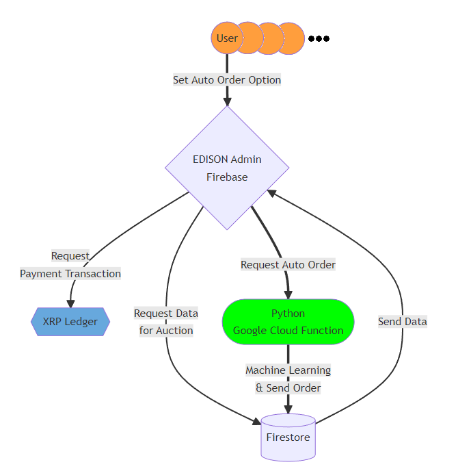
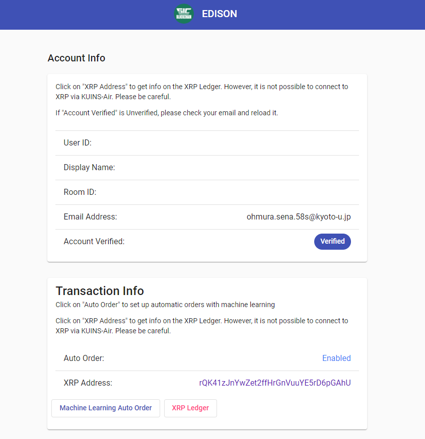
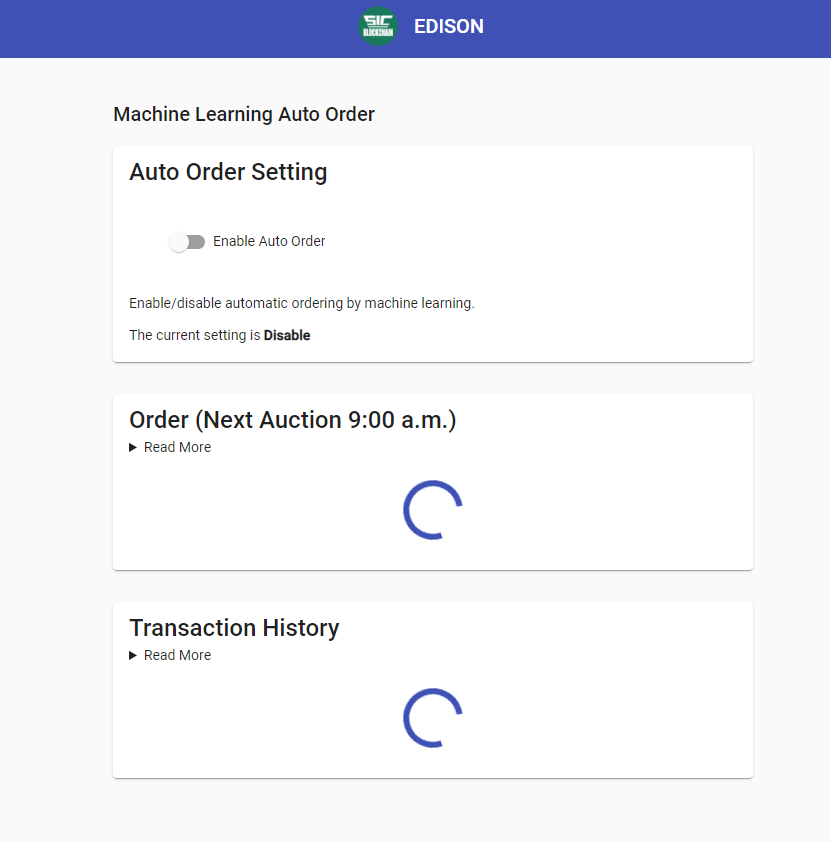

# EDISON-X 2022/05/16 発注分

2022/06/30 [株式会社 Interoperability Labs](https://ununifi.io) 大村瀬奈 作成

## 概要

電力取引の売買注文自動化で簡単な機械学習エージェントどうしの取引を実現します。
EDISON-X のユーザーは自動注文を WEB アプリ上から有効化/無効化することができ、有効化されている場合、機械学習を用いた注文を作成し、それを EDISON-X のデータベースに反映します。
この注文は他の注文と同様にシングルプライスオークションが行われ、電力使用権トークンの取引が行われます。

## 納品物一覧

### EDISON-X 機能追加

EDISON-X v2.1.0-rc1
<https://github.com/KyotoUniv-SIC/EDISON-X/releases/tag/v2.1.0-rc1>

- Account ページより自動注文機能の有効化・無効化ができる
- 自動注文ページより本日発行された自動注文の内容確認とキャンセルができる
- 自動注文ページより過去の注文の履歴を確認できる

## 機械学習での自動注文プログラム作成

machine-learning-auto-order v0.0.1
<https://github.com/KyotoUniv-SIC/machine-learning-auto-order/releases/tag/v0.0.1>

- OpenAI gym の [CartPole-v1](https://www.gymlibrary.dev/environments/classic_control/cart_pole/) を使用した機械学習プログラム
- EDISON-X のデータベースよりユーザー情報及び注文状況を取得するプログラム
- EDISON-X のデータベースに機械学習により作成した注文を反映するプログラム

## EDISON-X 機能追加 詳細

### Account ページより自動注文機能の有効化・無効化ができる

アカウント詳細ページに自動注文を管理するページへのリンクを作成し、該当ページ内で自動注文の有効化・無効化の切り替えが可能です。

有効化状況は即座に切り替え可能で、翌日の自動注文から設定が反映されます。

 
 

### 自動注文ページより本日発行された自動注文の内容確認とキャンセルができる

### 自動注文ページより過去の注文の履歴を確認できる

自動注文ページ内に本日行われた注文と過去の注文の履歴が表示され、ユーザーが確認することができます。
当日の注文はユーザーが手動でキャンセルすることができます。
過去の注文は成約の可否と注文日の成約価格を確認することが可能です。

## 機械学習での自動注文プログラム作成 詳細

### OpenAI gym の CartPole-v1 を使用した機械学習プログラム

OpenAI gym の CartPole-v1 を用いた機械学習での注文プログラムを Python を用いて作成しております。
参考: <https://www.gymlibrary.dev/environments/classic_control/cart_pole>

これを用いて自動注文を行うのは EDISON-X の取引データ量が十分でないことから現在では難しい状況です。
そのため、ルールベースでの自動注文プログラムを当面の間、代替の方法として用いる予定です。ルールベースの自動注文プログラムについてはアルゴリズムの策定と文献の調査をしており、決定次第本機能の代替として使用される予定です。

### EDISON-X のデータベースよりユーザー情報及び注文状況を取得するプログラム

機械学習プログラムで利用するためのデータを EDISON-X のデータベースより取得するためのプログラムを機械学習プログラムと同じく Python で実装しております。
自動注文の利用有無を確認するためにユーザー情報と学習に用いるための過去の注文情報を取得しています。現在の注文情報はブラインド注文のシングルプライスオークション形式のため使用していません。

### EDISON-X のデータベースに機械学習により作成した注文を反映するプログラム

機械学習で作成した注文データを EDISON-X のデータベースに反映するためのプログラムも同様に作成しております。
注文はユーザーが直接作成した注文とは区別されますが、区別することが可能で、EDISON-X 機能追加の自動注文のログでは自動注文のみを表示しております。
